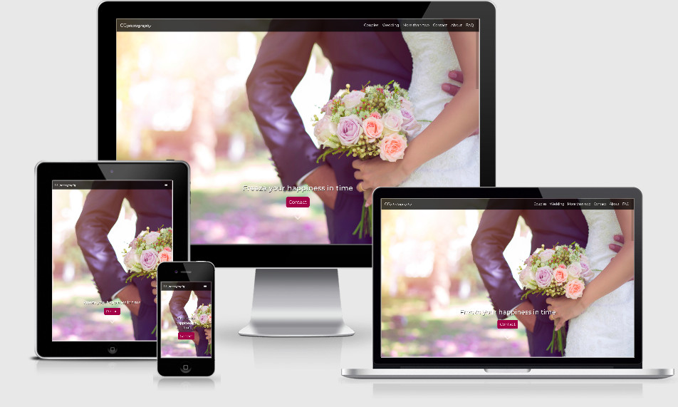
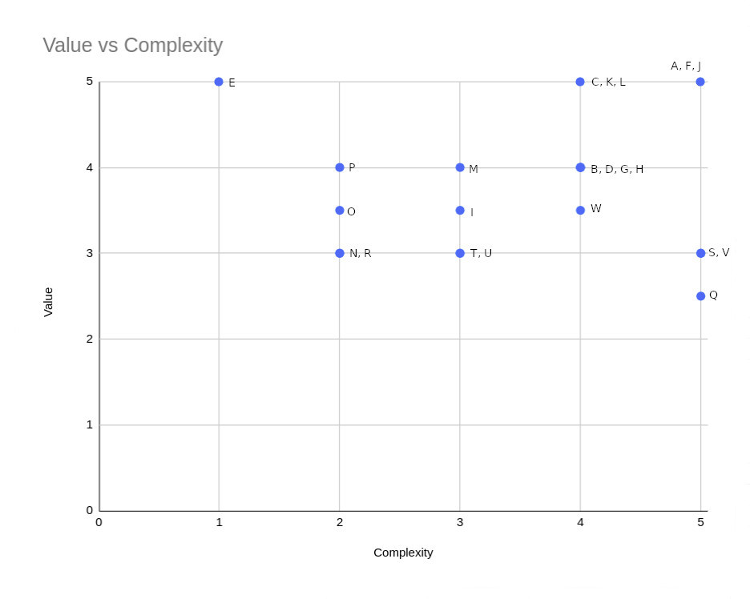

# CG*photography*

CGphotography is a couple photography website.

It presents the previous works of the photographer in order to attract new clients. The portfolios present:
* Couples photographs
* Wedding photographs
* More than two photographs

## Demo

A live demo can be found [here](https://itamichan.github.io/CG_photography/)

## UX

### Goals

#### CGphotography goal

The goal of this web page is to present previous works of the photographer and as such, attract new clients.

**Target audience is:**
* Couples with the age between 20-45 years.
* Couples interested in photo services.
* Couples interested in wedding photo services. 
* Couples interested in pregnancy photo services. 

#### Business goals

* Reach the new, potential customers.
* Have a high conversion rate.
* Have a fully proficient web page.
* Have an intuitive design.

#### Visitor goals

* Find a photographer for their photo session.
* Find previous works made by the photographer.
* Find contact information of the photographer.

Both business and visitor goals are addressed through user stories.

### User Stories

#### The Photographer

* As a photographer, I want to show my previous works so that people hire me.
* As a Photographer, I want my page to load fast so that the user is engaged.
* As a Photographer, I want the potential customers to have an easy way to find my contact details so that they can order a photo session.
* As a photographer, I want to show positive reviews so that I convince people to book my services.
* As a photographer, I want them to know my current location so that I can  avoid orders that are too far away for me to come.
* As a Photographer I want that the user remember me so that they come back.

#### The UX designer

* As a UX designer, I want to track the user behaviour so that I can improve the user experience.
    * As a UX designer, I want to track the user behaviour so that I can identify the possible user confusion.
    * As a UX designer, I want to find which parts are not accessed by the user so that I can improve the website’s structure.

#### The potential customer

* As a customer, I want to know the prices of the services so that I can decide if I want to pay the price.
* As a customer, I want to see the  previous work so that I can decide if I would like to have something similar or not.
* As a customer, I want to have an easy way to contact the photographer so that I can book a session.
* As a customer, I want an easy way to contact the photographer so that I can clarify some information.
* As a customer, I want to know if the photographer is willing to come to remote/distant locations so that I can have a photo session there.
* As a customer, I want to know what is the duration of the photo session so that I know how much time it will take.
* As a customer, I want to know how many photos I will get so that I can assess if this is enough for me or not.
* As a customer, I want to know if the photos will be edited so that I have a professional editing of my photographs.
* As a customer, I want to know what are the photographer’s values and vision so that I can know if they align with mine.
* As a customer, I want to know if I can change the clothing during the photo session so that I can have different looks.

#### The future married couple

* As a couple, we want to be able to see when the photographer is available so that we can book his services on our wedding day.
* As a couple, we want to divide our photo session in two different days so that we can have a wedding and pre-wedding photo session.
* As a couple, we want to know if any discount system exists so that we can  take benefit of it.
* As a couple, we want to have a physical photo album so that we can have a paper version of our photographs.
* As a couple, we want to choose how our photo album looks so that it is personalized.

All User Stories were added as [issues](https://github.com/Itamichan/CG_photography/issues?q=is%3Aopen+is%3Aissue) on GitHub in order to keep track and address them in the project's [dashboard](https://github.com/Itamichan/CG_photography/projects/1).

### Minimum Viable Product

All the User Stories have been assessed against value/complexity chart. Considering the relative short time of implementation of the web page only the MVPs will be addressed in the first release of the web page.

[User Stories evaluation](MVP/user-stories.md)

#### Explanation of the chart

* The top right corner have been given the higher priority of implementation because it represents the most important functionality features. Such as:
    * The Contact Form.
    * The Portfolios.
    * The Gallery.
* Features with a medium value and with a low complexity have been addressed in second place since most of them can be easily resolved through creation of the FAQ Page.
* Features with low complexity and low value where addressed in the third place. It didn't represent a must feature for the first release but was very easy to be done.
* Features with medium value and high complexity have been postponed for future releases.

User Stories identified as important for MVP were attributed the respective label in the [issues](https://github.com/Itamichan/CG_photography/issues?q=is%3Aopen+is%3Aissue) section on GitHUb.

### Design

#### Colors

Following colors have been used:
* `#932244` - dark pink
* `#7e1f3f` - darker version of the initial pink
* `#000000` - black
* `#ffffff` - white
* `#898989` - grey
* `#6a6a6a` - dark grey

The stand out color for this web page is dark pink which according to [Color Psychology](https://www.colorpsychology.org/pink/) is associated with romance, love, femininity and tenderness. 

Considering that this color is very strong and easily attract attention I decided to not use any other bright colors. Therefore, the other used colors are the classic white and black.

The grey colors were used for "close" button in the form.

#### Font

Used Font Family for this project is **Montserrat** with the font weight: 
* 400 - for most of the text.
* 500 - for logo, button and headers on the hero images.
* 600 - for heavy headers.

The [Montserrat](https://fonts.google.com/specimen/Montserrat) font was chosen for its easy readability and common use.

### Wireframes

Considering that CG*photography* has at its core presentation of photographs I decided that it will be more helpful to have mockups than simple wireframes. The mockups were done in [figma](https://www.figma.com/). 

Link to the mockup: [here](https://www.figma.com/file/yAH8DKgNrouL7mu2Jc0Ipv/CGphotography?node-id=0%3A1). The mockup was done for the mobile first approach view. The final result on tablet and desktop has only minor differences in comparison with the mobile view.
Besides the preliminary design of the web page, I also created a prototype of the flow between the pages. You can try this by pressing the play button in [figma](https://www.figma.com/). 

## Features

### Existing Features:

#### Elements present on every page

* **Navigation bar** - Has a `fixed` position in order to ensure that the user can access it at any time.
    * CG*photography* logo in the left corner which serves as a link to go back to the landing page.
    * Links that can be accessed are placed on the right side. They collapse if the screen width is bellow 992px.
* **Footer**
    * Call to Action part - contains call to action text and the contact button.
    * Main part
        * Explore column - contains links to different parts of the web page.
        * Contact column - disappears on small screens in order to avoid a cluttered footer.
        * Follow me column - contains links to social media
    * Addresses issue #3, #5, #10 & #11.
* **Modal Contact Form**
    * The Contact Form is present on every page so that the user can easily find it. Additionally, it comes up us a modal window in order to fully capture the attention of the user, as well as to reduce the waiting time.
    * Addresses issue #3, #10 & #11.
* **Hero Image** - with the exception of the landing page which has a carousel.
    * Each page has a hero image with text which is related to the content of the page. It helps the user to understand where they are placed at the moment.

#### Other elements

* **Portfolio** - every type of couple photography has its own portfolio and a subsequent portfolio with specific photo sessions. They were created in order to create a clear distinction between different types of photographs and give the user the chance to choose the portfolio in which they are the most interested.
    * Addresses issue #1 & #9.
* **Gallery** - every individual album contains a gallery of 12 photographs. The gallery are created in order to show the previous works of the photographer.
    * In order to have a fast loading page the maximum width of a photograph is 750px. This decision was made considering that 750px is the largest size the photograph will ever have in a screen. In this way the weight of the photographs is greatly reduced.
    * Addresses issue #1, #2 & #9.
* **Testimonials** - this section was created in order to show to the potential customer what other customers though about the photographer and her work.
    * Addresses issue #4.
* **FAQ page** - after the evaluation of the User Stories it became clear that a potential customer can have a lot of common questions which can be answered in an FAQ. In this way the user will be more informed in a short time and will contact the photographer only for more specific question. In the same time, the photographer will not have to answer to a common question on repetitive occasions.
    * Addresses issue #5, #8, #12, #13, #14, #15, #17, #19 & #20.
* **About page** - this page's goal is to give a short insight about the photographer and give once again contact details. Especially, that the Contact details from the footer are not present on smaller screens.
    * Addresses issue #3, #5, #10, #11 & partially #16.

### Features left to implement

* **FAQ page** - User Story #21 & #27, where the user is interested in the option of a physical photo album.
* **About page** - User Story #16, where user is interested in the photographer's values and vision.
* **Contact Form** - User Story #18, where the user wants to know the photographer's availability. Additionally, they want to be able to book a date directly in an existing calendar.
* **Album covers** - From user testing I identified that some users don't realise that the albums are clickable.
## Technologies Used

### Languages

* HTML - served as the base language for this project.
* CSS - used for styling the HTML code.
* [Sass](https://sass-lang.com/) - used for creation of variables, mixins and easy nesting of styles.

### Libraries

* [Bootstrap](https://getbootstrap.com/) - used for responsive grid system. As well as for navigation, modal contact form and carousel of images.
* [JQuery](https://jquery.com/) & [Popper](https://popper.js.org/) - were used in connection with the functionality of the Bootstrap library.
* [FontAwseome](https://fontawesome.com/) - used for social media icons as well as for contact related icons.
* [Google Fonts](https://fonts.google.com/) - used for the Montserrat font.

### Tools

* [WebStorm](https://www.jetbrains.com/webstorm/) - used as local IDE for this project.
* [Git](https://git-scm.com/) - used for version control.
* [GitHub](https://github.com/) - used as a remote repository.
* [GitHub Pages](https://pages.github.com/) - used for hosting the web page.
* [Figma](https://www.figma.com/) - used for creation of mockups.
* [favicon.io](https://favicon.io/) - used for creation of the fav icon for the web page.
* [GIMP](https://www.gimp.org/) - used as image editor.
* [Tinyjpg](https://tinyjpg.com/) - used for image compression.
* [Am I Responsive](http://ami.responsivedesign.is/) - used for testing purposes as well as to create the image displaying the web page on different devices.
* [Google Chrome DevTools](https://developers.google.com/web/tools/chrome-devtools) - used for testing and debugging.
* [Google Analytics](https://analytics.google.com/) - used for testing purposes.
* [Hotjar](https://www.hotjar.com/) - used for testing purposes.
* [PageSpeed insights](https://developers.google.com/speed/pagespeed/insights/) - used for testing the loading speed.

## Testing

Testing information can be fond [here](testing/testing.md).

## Deployment

This web page was locally developed in WebStorm and pushed to the remote repository - GitHub. The live page is hosted on GitHub Pages. 

### Deployment to GitHub

In order to connect the local IDE to GitHub I used the command `git remote add origin` and added the link to the remote repository: https://github.com/Itamichan/CG_photography.git

My main local branch is `master` which I deployed as `origin/master` to GitHub. All different features were first developed on a separate branch and deployed on a remote, same name branch, to GitHub. Once the feature was ready to go live it was merged to the master branch.

**Used commands during development:**
* git branch feature/specific_feature - to create a new local branch for a specific feature.
* git add . - to add the files to the staging area.
* git commit -m "text message here" - to commit the files.
* git merge name_of_the_branch --no-ff - done from master branch in order to merge a feature branch into the master branch without fast forwarding.
* git push origin master - to push to origin master branch on GitHub.
* git push origin branch_name - to push to origin specific branch name on GitHub.
* git checkout name_of_the_branch - in order to leave the current branch and move to a new one.
* git status - was extensively used in order to see the current status of the files.

### How to host this project on GitHub Pages

* Log into GitHub.
* From the list with repositories choose [CG*photography*](https://github.com/Itamichan/CG_photography).
* Go to settings.
* Scroll down to GitHub Pages section.
* Select as a source master branch.
* The page is now automatically refreshed and the project is deployed.
* To access the project scroll down again to GitHub Pages section and click on the provided link.
* For your convenience, save the link as a bookmark.

For more detailed information regarding deployment to GitHub Pages click [here](https://pages.github.com/)

### How to run this project locally

**Clone this project from GitHub:**

* Go to [CG*photography*](https://github.com/Itamichan/CG_photography) GitHub repository.
* Click on "Clone or download" green button.
* Copy the URL to the repository.
* Open the terminal in your local IDE.
* Choose the working directory where you would like to have the cloned repository.
* Type git clone, and add the URL you copied from Github: `git clone https://github.com/Itamichan/CG_photography.git`
* Press Enter and your local clone will be created.
* You are good to go.

For more information regarding cloning of a repository click [here](https://help.github.com/en/github/creating-cloning-and-archiving-repositories/cloning-a-repository).

## Credits

### Content

All content on the web page was written by me with the exception of the quote in the About page which was written by an anonymous person and posted on [dpreview.com](https://www.dpreview.com/forums/thread/3680347). 

### Media

**Photographs for Couples page:**
* [Ion Ples Alexandru photography](https://ionplesalexandru.com/features-works/)

**Photographs for Wedding page:**

* [Ion Ples Alexandru photography](https://ionplesalexandru.com/features-works/)
* [Vadim Jantic photography](http://jantic.md/weddings.html)

**Photographs for More than two page:**

* [UND photography](https://undphotography.ro/)
* [Cristina Velina](https://fotografbotezbucuresti.ro/portofoliu/sedinte-foto/)

**Photographs for various pages:**

* [Adorable Wallpapers](http://avante.biz/camera-image-wallpapers-22-wallpapers/)
* [WallpapersCraft](https://wallpaperscraft.com/download/couple_hands_love_tenderness_coffee_118921/1366x768)
* [Ashley Smith](https://www.ashleysmithphotos.com/)

### Acknowledgements

#### Pages used for Inspiration

* [Ion Ples Alexandru photography](https://ionplesalexandru.com/features-works/)
* [Vadim Jantic photography](http://jantic.md/weddings.html)
* [Maxim Chumash photography](http://chumash.us/)
* [Scott Kelby](https://scottkelby.com/)
* [Fiona Kelly photography](https://www.fionakellyphotography.com/blog/)
* [Peter McKinnon](http://www.petermckinnon.com/)
* [Dave Marrow photography](https://photos.davemorrowphotography.com)
* [Vadim Jantic](http://jantic.md/weddings.html)
* Inspiration resources for writing this README file:
    * [Mattlister](https://github.com/Mattlister/The-Monkees-Monkees)
    * [AJGreaves](https://github.com/AJGreaves/familyhub)
    * [TravelTimN](https://github.com/TravelTimN/ci-milestone01-ucfd)
   

#### Pages used for information

* [UX Planet](https://uxplanet.org/information-architecture-basics-for-designers-b5d43df62e20)
* [tubik](https://tubikstudio.com/)
* [stormotion](https://stormotion.io/blog/how-to-write-a-good-user-story-with-examples-templates/)
* [Agile Alliance](https://www.agilealliance.org/)
* [W3schools](https://www.w3schools.com/)
* [W3schools](https://www.w3schools.com/)
* [W3C](https://www.w3.org/)
* [stack overflow](https://stackoverflow.com/) - massively used for debugging and understanding certain concepts.
* [CSS-Tricks](https://css-tricks.com/)
* [MDN web docs](https://developer.mozilla.org/)

### Disclaimer

**This web page was created for educational use only.** 